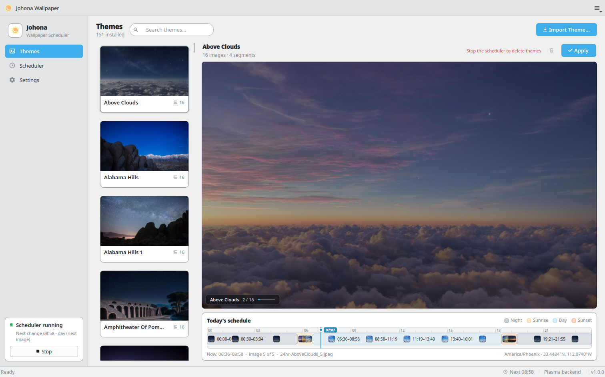
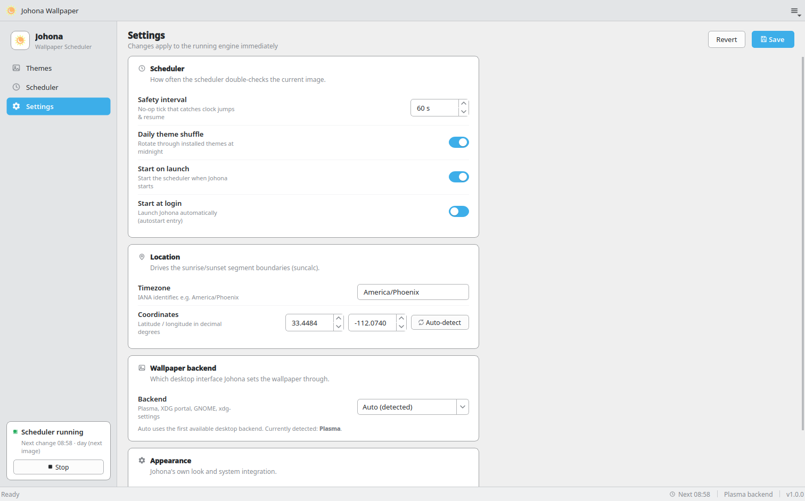

# Johona Wallpaper

> ⚠️ **Disclaimer** — This project was completely vibecoded using
> **Qwen3.8-27B-Q8**. No human wrote a line of the code; the model did, from
> prompts alone. Expect the usual consequences.

Johona is a **C++/Qt 6 Flatpak** rewrite of [kWallpaper](../kwallpaper) 1.1.0:
it changes your desktop wallpaper by time of day, driven by
[24hr Wallpaper](https://www.jetsoncreative.com/24hourwindows) (`.ddw`) theme
packs. App ID `top.spelunk.johona`, binary `johona`.

The rewrite fixes the three structural problems of the original:

1. **Timing** — kWallpaper's `astral`-based math produced different boundary
   times than WinDynamicDesktop's own `suncalc`-based timing. Johona ports
   `suncalc` directly, so boundaries are **WDD-identical** and fully offline.
2. **Scheduling** — kWallpaper re-applied the wallpaper every 60 s. Johona is
   **event-driven**: a one-shot timer armed at the exact next image boundary,
   plus a safety tick that acts only when needed (clock jumps, resume from
   suspend, date rollover).
3. **Desktop support** — kWallpaper required KDE Plasma 6. Johona has
   pluggable backends: **Plasma D-Bus**, the **XDG Background portal**,
   **GNOME** (`gsettings`), and **`xdg-settings`** (X11), auto-detected with a
   manual override.

## Features

- **WDD sun-segment model** — four segments (sunrise / day / sunset / night)
  with per-segment image lists, the WDD duplicate-list absorption quirk
  (identical sunrise+day lists start the day at true sunrise), and WDD's four
  polar states (polar day, polar night, and the two civil-polar cases).
- **Theme management** — import `.ddw`/`.zip` packs (validated: every listed
  image must exist), browse, delete. All heavy work runs off the GUI thread.
- **Instant previews** — adaptive-resolution thumbnails decoded on a worker
  pool, cross-fade preview widget, and a 24-hour schedule preview with
  segment bands, image thumbnails at their display times, and a live
  current-time marker.
- **Daily shuffle** — optional rotation across installed themes; state is
  persisted only after a successful apply, so failures retry the same theme.
  A missed midnight (suspend/reboot) is picked up on the next activity.
- **Location** — city/lat/lon/IANA-timezone config, a bundled IANA
  timezone→coordinates table for city lookup, and Geoclue2 auto-detect.
- **Scheduler tab** — start/stop, status, next-change time, live event log.
- **System tray** — start/stop, show/hide, theme-aware light/dark icons.
- **Single instance** — a second launch focuses the running window.
- **One-time migration** — on first run, Johona copies kWallpaper's Flatpak
  data (themes + config) into its own sandbox; the old data is left
  untouched.

## Screenshots

Themes tab — installed theme cards, live preview, and the 24-hour schedule:



Settings tab — scheduler, location, wallpaper backend, and appearance:



## How the timing works

All solar math is a faithful C++ port of
[suncalc v1.9.0](https://github.com/mourner/suncalc) (see
[Acknowledgments](#acknowledgments) for the license). The ported suncalc test
vectors (2013-03-05 at 50.5°N/30.5°E, 2000 m elevation) are included 1:1 as
the `test_suncalc` unit-test suite.

On top of that, the segment model follows
[WinDynamicDesktop](https://github.com/t1m0thyj/WinDynamicDesktop):

- Phase times are the sun-altitude crossings **dawn/dusk at −6°**,
  **golden-hour end/start at +6°**, and true sunrise/sunset at −0.833°.
- Segments are computed at **UTC noon of the target date** (WDD's trick,
  which sidesteps a suncalc date-rollover edge case), then converted to local
  wall-clock time via `QTimeZone` (robust IANA + DST handling).
- Polar states are crossing-based, exactly as in WDD:
  - **Polar day** — day images span the full 24 h.
  - **Polar night** — night images span the full 24 h.
  - **Civil polar day** — no dawn/dusk crossing → the night segment is
    skipped.
  - **Civil polar night** — no golden-hour crossing → the day segment
    collapses to noon.
- `nextChangeTime()` computes the exact next image boundary so the scheduler
  can arm a single one-shot timer instead of polling.

The scheduler then has one periodic timer left — the *safety tick*
(default 60 s) — which is a no-op unless something changed (wall/monotonic
clock drift > 2 s, resume from suspend via `login1`, date rollover, or a
missed boundary). There is no per-minute re-apply.

## Architecture

```
johona/
├── CMakeLists.txt
├── src/
│   ├── core/                 # headless, display-independent library
│   │   ├── suncalc.{hpp,cpp}     # C++ port of mourner/suncalc v1.9.0 (pure math)
│   │   ├── solar.{hpp,cpp}       # WDD segment model on top of suncalc
│   │   ├── scheduler.{hpp,cpp}   # one-shot boundary timer + safety tick
│   │   ├── engine.{hpp,cpp}      # orchestrates apply/retry/shuffle/safety
│   │   ├── backends.{hpp,cpp}    # Plasma / portal / GNOME / xdg-settings
│   │   ├── themes.{hpp,cpp}      # discovery, import (.ddw/.zip), validation
│   │   ├── shuffle.{hpp,cpp}     # daily shuffle state (single writer)
│   │   ├── config.{hpp,cpp}      # JSON config (v1 schema, kWallpaper-compatible)
│   │   ├── location.{hpp,cpp}    # tz table, Geoclue2 detect
│   │   ├── migration.{hpp,cpp}   # one-time kWallpaper data migration
│   │   ├── autostart.{hpp,cpp}   # host ~/.config/autostart entry
│   │   └── clock.hpp             # injectable clock (deterministic tests)
│   └── gui/                  # Qt Widgets frontend
│       ├── main.cpp                # single instance, engine on a QThread
│       ├── mainwindow.*            # title bar + hamburger menu, sidebar nav,
│       │                           #   stacked pages, slim status bar, tray
│       ├── themestab.*             # theme card list + delegate, preview panel
│       ├── schedulepreview.*       # 24 h timeline with segment bands
│       ├── previewwidget.*         # thumbnail cross-fade (LRU cache, overlay chip)
│       ├── settstab.*              # card-based settings with switches
│       ├── schedulertab.*          # status hero + filtered event log
│       ├── style.hpp               # Breeze 6.7 tokens + app stylesheet
│       ├── widgets.{hpp,cpp}       # StatusDot, NavItem, StatusMessageLabel
│       └── enginebridge.hpp        # queued-call bridge (QPromise/QFuture)
├── tests/                    # 9 suites, 95 tests (QtTest, ctest)
├── data/                     # icons, .desktop, metainfo, autostart template
├── resources/                # tz_coordinates.json (418 IANA zones)
├── flatpak/                  # flatpak-builder manifest + build script
├── tools/sdk.sh              # run build tools inside the KDE Flatpak SDK
└── third-party/              # vendored libzip 1.11.4 + suncalc license
```

**Threading model.** The `Engine` (and its `Scheduler`) runs on a dedicated
`QThread`; the GUI talks to it through queued invocations
(`enginebridge.hpp` wraps calls in `QPromise`/`QFuture` so results come back
on the GUI thread). All blocking work — D-Bus, subprocesses, file I/O, image
decoding — happens off the GUI thread. The core library has no display
dependency, which is what makes the unit tests fast and hermetic.

**Failure handling.** A failed wallpaper set is retried exactly once after
5 s; if it fails again, the attempt is deferred to the next safety tick.
Shuffle state is persisted only after success.

## Building

Johona is distributed **as a Flatpak only**; there is no system-package
install path. Development builds use the KDE Flatpak SDK toolchain (no root
required):

```sh
# configure + build (runs cmake/ninja/g++ inside org.kde.Sdk//6.9)
tools/sdk.sh cmake -S . -B build -G Ninja
tools/sdk.sh ninja -C build

# run the test suites
tools/sdk.sh ctest --test-dir build --output-on-failure

# run the GUI (offscreen smoke test; on a real session just run the binary)
QT_QPA_PLATFORM=offscreen ./build/src/gui/johona
```

Build the Flatpak (requires `flatpak-builder` and the `org.kde.Platform//6.9`
+ `org.kde.Sdk//6.9` runtimes from Flathub):

```sh
flatpak/build.sh            # build + install to the --user remote
flatpak/build.sh bundle     # also produce top.spelunk.johona.flatpak
```

Then: `flatpak run top.spelunk.johona`.

### Vendored dependencies

- **libzip 1.11.4** — vendored in `third-party/` and built statically
  (optional codecs/crypto disabled). It is not in the KDE runtime, and
  `.ddw` packs are zip files.
- **suncalc v1.9.0** — ported to C++ in `src/core/suncalc.{hpp,cpp}`; the
  upstream license is kept in `third-party/SUNCALC-LICENSE`.

## Testing

Nine QtTest suites, 95 tests, all hermetic (injectable clock, fake D-Bus bus,
in-memory process runner, temp-file themes):

| Suite | Covers |
|---|---|
| `test_suncalc` | ported suncalc v1.9.0 test vectors, 1:1 |
| `test_solar` | segment model, WDD quirks, all four polar states, next-boundary |
| `test_config` | JSON load/save/validate, type coercion, defaults |
| `test_themes` | discovery, import/extract, validation, delete |
| `test_shuffle` | list build, wrap, staleness, forced-theme, persistence |
| `test_scheduler` | one-shot arming, reschedule-only-earlier, tick safety |
| `test_engine` | apply/retry (5 s, injectable), daily advance, safety tick, config |
| `test_location` | tz table lookup, TZ detection, Geoclue2 (fake bus) |
| `test_migration` | idempotent kWallpaper migration, path remap |

## Data & migration

- Config: `~/.config/johona/config.json` (v1 schema, kWallpaper-compatible
  layout)
- Themes: `~/.local/share/johona/themes/`
- Shuffle state: `~/.local/share/johona/shuffle-list.json`
- Thumbnail cache: `$XDG_CACHE_HOME/johona/`

On first launch, if the old `top.spelunk.kwallpaper` Flatpak data directory
exists, its themes and config are copied into Johona's directory and the
config's paths are remapped. The migration is idempotent and never modifies
the old data.

## Acknowledgments

Johona builds directly on the work of others:

- **[WinDynamicDesktop](https://github.com/t1m0thyj/WinDynamicDesktop)** by
  **t1m0thyj** (MIT-licensed project, `MPL-2.0` for the C# sources) — the
  inspiration for this project's sun-segment wallpaper model. The segment
  timing, the UTC-noon computation trick, the duplicate-list absorption
  behavior, and the four polar states all follow WDD's
  [`SunriseSunset.cs`](https://github.com/t1m0thyj/WinDynamicDesktop/blob/master/WinDynamicDesktop/SunriseSunset.cs)
  / [`SolarScheduler.cs`](https://github.com/t1m0thyj/WinDynamicDesktop/blob/master/WinDynamicDesktop/SolarScheduler.cs)
  so that boundary times match WDD's.
- **[suncalc v1.9.0](https://github.com/mourner/suncalc)** by
  **Vladimir Agafonkin** — the solar position math that WDD itself is built
  on. `src/core/suncalc.{hpp,cpp}` is a faithful C++ port of the
  [v1.9.0 release](https://github.com/mourner/suncalc/tree/v1.9.0); the
  upstream [LICENSE](https://github.com/mourner/suncalc/blob/v1.9.0/LICENSE)
  file for that release is **BSD-2-Clause** (© 2014 Vladimir Agafonkin) and
  is reproduced in [`third-party/SUNCALC-LICENSE`](third-party/SUNCALC-LICENSE).
  The ported upstream test vectors ship as `tests/test_suncalc.cpp`.
- **[24hr Wallpaper](https://www.jetsoncreative.com/24hourwindows)** by
  **Jetson Creative** — the `.ddw` theme format and the source of most
  installable themes.
- **[libzip 1.11.4](https://libzip.org/)** (Niels Provos & Markus Kuhn;
  BSD-3-Clause) — vendored in `third-party/` for `.ddw`/`.zip` extraction.
- **The Qt project** (Qt 6, LGPL-3.0-only) and **KDE** — the GUI toolkit and
  the Flatpak SDK/runtime used for all builds.

## License

Johona is licensed under the **Mozilla Public License 2.0** (see
[data/top.spelunk.johona.metainfo.xml](data/top.spelunk.johona.metainfo.xml)
for the AppStream declaration). Vendored third-party code keeps its own
licenses (see above).
